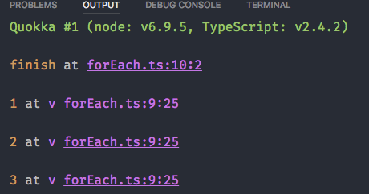
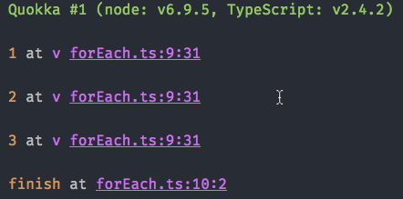

# 進階應用技巧

## Observable.forEach

RxJS 的 Observable 除了我們所熟悉的 subscribe，其實還可以透過 forEach 的方式取得 Observable 的資料。

### subscribe

Observable.subscribe 所需要傳入的引數可以是一個 `observer`物件，或是至少有一個負責 next 階段的函式。

```typescript
Observable.from([1,2,3]).subscribe(value=> console.log(value));
```

而 subscribe 會回傳一個 `subscription` 的物件，可以讓我們取消 Observable。

### forEach

仔細看 Observable 的原始碼，其實還又另外一個函式可以達到跟 `subscribe` 一樣的結果，`forEach` 只接受一個函式，這個函式只負責處理 `next` 階段的行為，且回傳的是一個 Promise<void>，而不是 `subscription`。原始碼是這樣子寫的

```typescript
forEach(next: (value: T) => void, PromiseCtor?: typeof Promise): Promise<void> {
    if (!PromiseCtor) {
      if (root.Rx && root.Rx.config && root.Rx.config.Promise) {
        PromiseCtor = root.Rx.config.Promise;
      } else if (root.Promise) {
        PromiseCtor = root.Promise;
      }
    }

    if (!PromiseCtor) {
      throw new Error('no Promise impl found');
    }

    return new PromiseCtor<void>((resolve, reject) => {
      // Must be declared in a separate statement to avoid a RefernceError when
      // accessing subscription below in the closure due to Temporal Dead Zone.
      let subscription: Subscription;
      subscription = this.subscribe((value) => {
        if (subscription) {
          // if there is a subscription, then we can surmise
          // the next handling is asynchronous. Any errors thrown
          // need to be rejected explicitly and unsubscribe must be
          // called manually
          try {
            next(value);
          } catch (err) {
            reject(err);
            subscription.unsubscribe();
          }
        } else {
          // if there is NO subscription, then we're getting a nexted
          // value synchronously during subscription. We can just call it.
          // If it errors, Observable's `subscribe` will ensure the
          // unsubscription logic is called, then synchronously rethrow the error.
          // After that, Promise will trap the error and send it
          // down the rejection path.
          next(value);
        }
      }, reject, resolve);
    });
  }
```

使用方法如下

```typescript
Observable.from([1,2,3]).forEach(value=> console.log(value))
  .then(()=> {
    // complete;
}).catch((err) => {
    // error
})
```

為什麼 RxJS 要有一個函式會回傳 Promise？當這個函式搭配 await / async ，會有一些不可思議的火花。

### 範例

沒有使用 async / await 時

```typescript
import 'rxjs/Rx';
import {Observable} from 'rxjs/Observable';

function getData() {
  return Observable.from([1, 2, 3]).delay(1000);
}

async function execute() {
  getData().forEach(v => console.log(v));
  console.log('finish');
}

execute();
```

執行結果



使用 async / await 時

```typescript
import 'rxjs/Rx';
import {Observable} from 'rxjs/Observable';

function getData() {
  return Observable.from([1, 2, 3]).delay(1000);
}

async function execute() {
  await getData().forEach(v => console.log(v));
  console.log('finish');
}

execute();
```

執行結果

