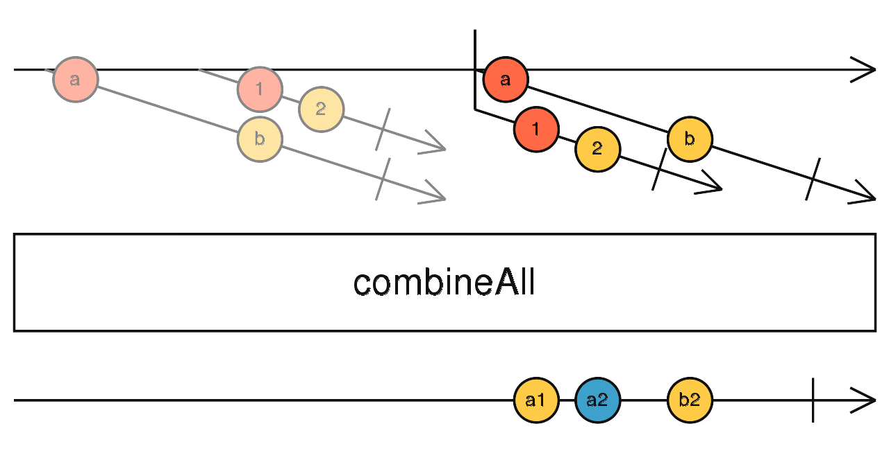
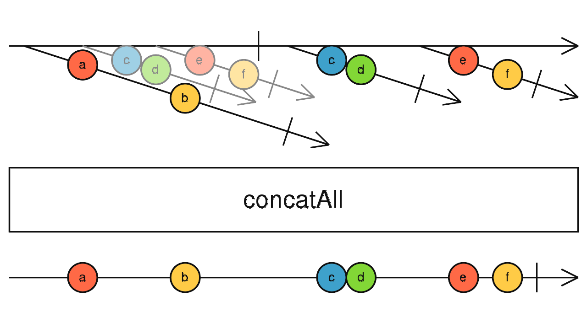
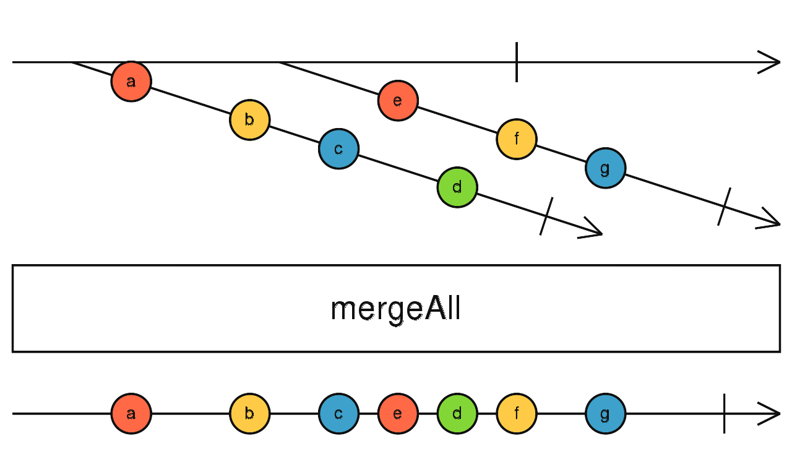
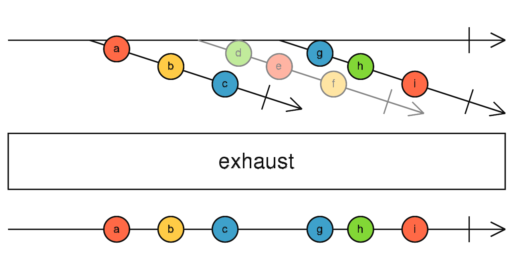
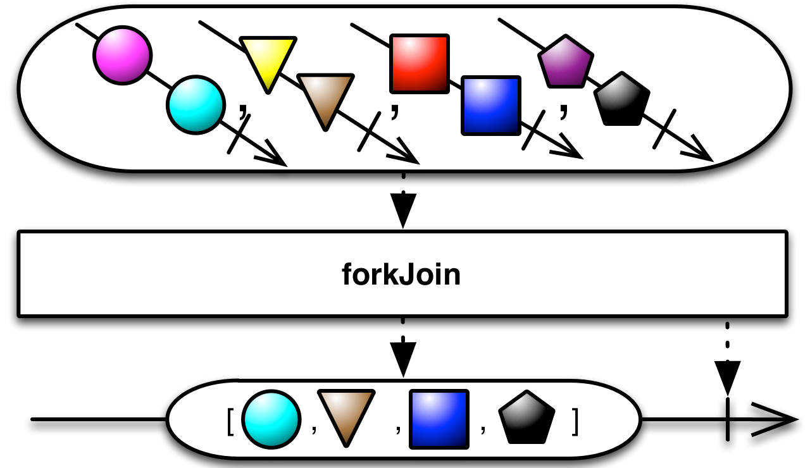
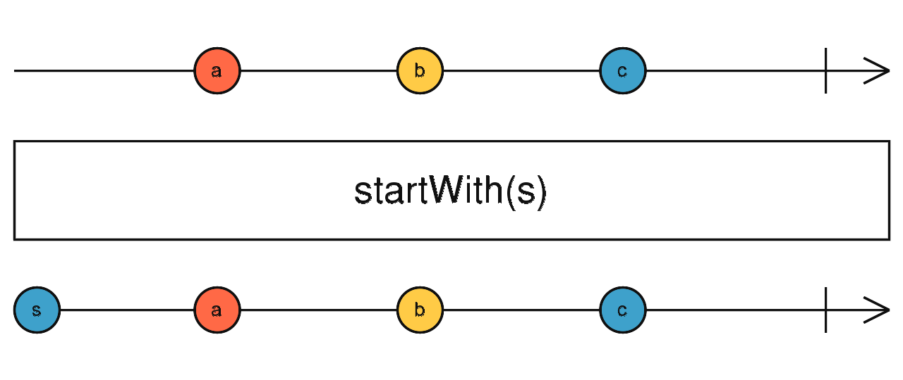
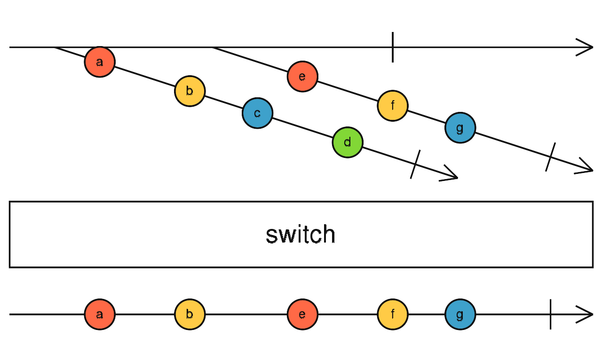
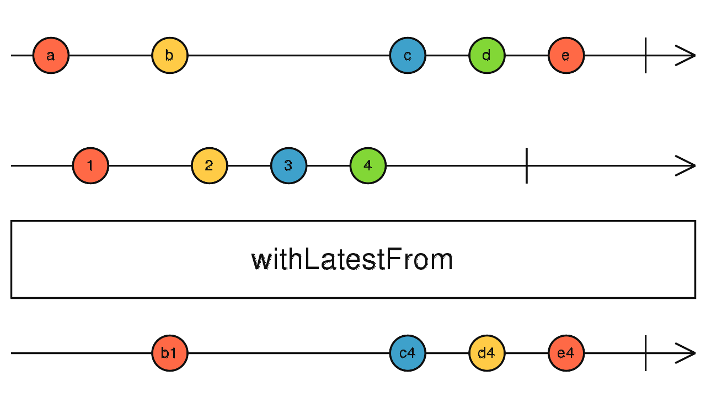

# Combination Operators

## combineAll




**使用介面**

```typescript
combineAll(project: function): Observable
```

**使用範例**

```typescript
Observable.interval(1000)
    .take(2)
    .map(value => {
      return Observable.interval(1000)
          .map(i => `Result (${value}): ${i}`)
          .take(3);
    })
    .combineAll()
    .subscribe(value => console.log(value));
/* 輸出
  ["Result (0): 0", "Result (1): 0"]
  ["Result (0): 1", "Result (1): 0"]
  ["Result (0): 1", "Result (1): 1"]
  ["Result (0): 2", "Result (1): 1"]
  ["Result (0): 2", "Result (1): 2"] 
*/  
```

## combineLatest

合併兩個 Observable，並使用各 Observable 最後發生的資料


**使用介面**

```typescript
combineLatest(observable1: ObservableInput, observable2: ObservableInput, project: function, scheduler: Scheduler): Observable
```

**使用範例**

```typescript
const firstTimer = Observable.timer(0, 1000); // emit 0, 1, 2... after every second, starting from now
const secondTimer = Observable.timer(500, 1000); // emit 0, 1, 2... after every second, starting 0,5s from now
const combinedTimers = Observable.combineLatest(firstTimer, secondTimer).take(4);
combinedTimers.subscribe(value => console.log(value));
/*
輸出: [ 0, 0 ],[ 1, 0 ],[ 1, 1 ],[ 2, 1 ]
*/
```

## concat

串接兩個 Observable 


**使用介面**

```typescript
concat(input1: ObservableInput, input2: ObservableInput, scheduler: Scheduler): Observable
```

**使用範例**

```typescript
const timer = Observable.interval(1000).take(4);
const sequence = Observable.range(1, 10);
const result = Observable.concat(timer, sequence);
result.subscribe(x => console.log(x));
/* 輸出:
0 -1000ms-> 1 -1000ms-> 2 -1000ms-> 3 -immediate-> 1 ... 10
*/
```

## concatAll



**使用介面**

```typescript
concatAll(): Observable
```

**使用範例**

```typescript
Observable.of('a', 'b')
    .map(x => Observable.range(1, 2).map(v => `{outer: ${x}, inner: ${v}`))
    .concatAll()
    .subscribe(x => console.log(x));
/* 輸出
{outer: a, inner: 1}
{outer: a, inner: 2}
{outer: b, inner: 1}
{outer: b, inner: 2}
*/
```

## merge

忽視 Observable 的資料發生順序，有資料產生就送出


**使用介面**

```typescript
merge(observables: ...ObservableInput, concurrent: number, scheduler: Scheduler): Observable
```

**使用範例**

```typescript
var timer1 = Rx.Observable.interval(1000).take(10);
var timer2 = Rx.Observable.interval(2000).take(6);
var timer3 = Rx.Observable.interval(500).take(10);
var concurrent = 2; // the argument
var merged = timer1.merge(timer2, timer3, concurrent);
merged.subscribe(x => console.log(x));
```

## mergeAll

基本上跟 merge 的功能是一樣的，只差在表示方式



**使用介面**

```typescript
mergeAll(concurrent: number): Observable
```

**使用範例**

```typescript
var clicks = Rx.Observable.fromEvent(document, 'click');
var higherOrder = clicks.map((ev) => Rx.Observable.interval(1000).take(10));
var firstOrder = higherOrder.mergeAll(2);
firstOrder.subscribe(x => console.log(x));
```

## exhaust

當一個 Observable 尚未執行完成時，在期間有另一個 Observable 被執行，而這個 observable 會被忽略



**使用介面**

```typescript
exhaust(): Observable
```

**使用範例**

```typescript
const clicks = Rx.Observable.fromEvent(document, 'click');
const higherOrder = clicks.map((ev) => Rx.Observable.interval(1000).take(5));
const result = higherOrder.exhaust();
result.subscribe(x => console.log(x));
```

## forkJoin

等所有的 sources 都回傳資料後，再一起送出


**使用介面**

```typescript
forkJoin(sources: *): any
```

**使用範例**

```typescript
const data1 = [1, 2, 3];
const data2 = ['a', 'b', 'c'];
Observable
    .forkJoin(
        Observable.of(data1).delay(1000), Observable.of(data2).delay(2000))
    .subscribe(value => console.log(value)); 
/*
輸出：[
		[1, 2, 3],
		['a', 'b', 'c']
	  ]
*/
```

## race

採用最先發送資料者的資料

**使用介面**

```typescript
race(): Observable
```

**使用範例**

```typescript
Observable.of('outer')
    .delay(400)
    .race(Observable.of('inner'))
    .subscribe(value => console.log(value)); // 輸出: inner
```

## startWith

在 Observable 的資料發生前，插入要開始的資料



**使用介面**

```typescript
startWith(values: ...T, scheduler: Scheduler): Observable
```

**使用範例**

```typescript
Observable.of('outer')
    .startWith('1','2','3')    
    .subscribe(value => console.log(value)); // 輸出: 1, 2, 3, outer
```

## switch

後面發生的 Observable 會接手並取消之前發生的 Observable



**使用介面**

```typescript
switch(): Observable<T>
```

**使用範例**

```typescript
// 每一次的 click 都會取消之前的 Observable，重新啟動新的 observable.interval(1000)
var clicks = Rx.Observable.fromEvent(document, 'click');
var higherOrder = clicks.map((ev) => Rx.Observable.interval(1000));
var switched = higherOrder.switch();
switched.subscribe(x => console.log(x));
```

## withLatestFrom

合併兩個 Observable, 並取每一個 observable 最後一次發生的資料當做資料轉換的根據



**使用介面**

```typescript
withLatestFrom(other: ObservableInput, project: Function): Observable
```

**使用範例**

```typescript
Observable.interval(1000)
    .take(3)
    .withLatestFrom(
        Observable.timer(500, 250),
        (outer, inner) => `{outer:${outer}, inner: ${inner} }`)
    .subscribe(value => console.log(value)); 
/* 
輸出: 
{outer:0, inner:1}
{outer:1, inner:5}
{outer:2, inner:9}
*/
```

## zip

當監視的 Observable 都有回傳資料時，才會變成一組資料發出

**使用介面**

```typescript
zip(observables: *): Observable<R>
```

**使用範例**

```typescript
let age$ = Observable.of<number>(27, 25, 29);
let name$ = Observable.of<string>('Foo', 'Bar', 'Beer');
let isDev$ = Observable.of<boolean>(true, true, false);

Observable
    .zip(age$,
         name$,
         isDev$,
         (age: number, name: string, isDev: boolean) => ({ age, name, isDev }))
    .subscribe(x => console.log(x));

// outputs
// { age: 27, name: 'Foo', isDev: true }
// { age: 25, name: 'Bar', isDev: true }
// { age: 29, name: 'Beer', isDev: false }
```

## zipAll

**使用介面**

```typescript
zipAll(project: *): Observable<R> | WebSocketSubject<T> | Observable<T>
```

**使用範例**

```typescript
let age$ = Observable.of<number>(27, 25, 29);
let name$ = Observable.of<string>('Foo', 'Bar', 'Beer');

age$.map(() => name$)
    .zipAll(function(age, name) {
      return ({age, name});
    })
    .subscribe(value => console.log(value));
/* 輸出
{ age: 27, name: 'Foo'}
{ age: 25, name: 'Bar'}
{ age: 29, name: 'Beer'}
*/
```