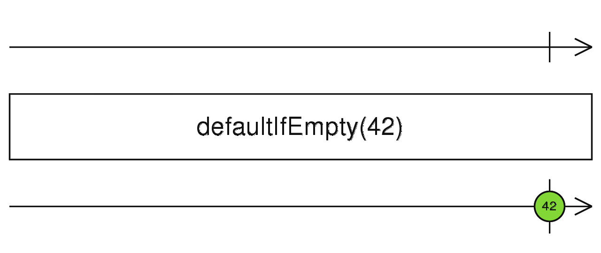
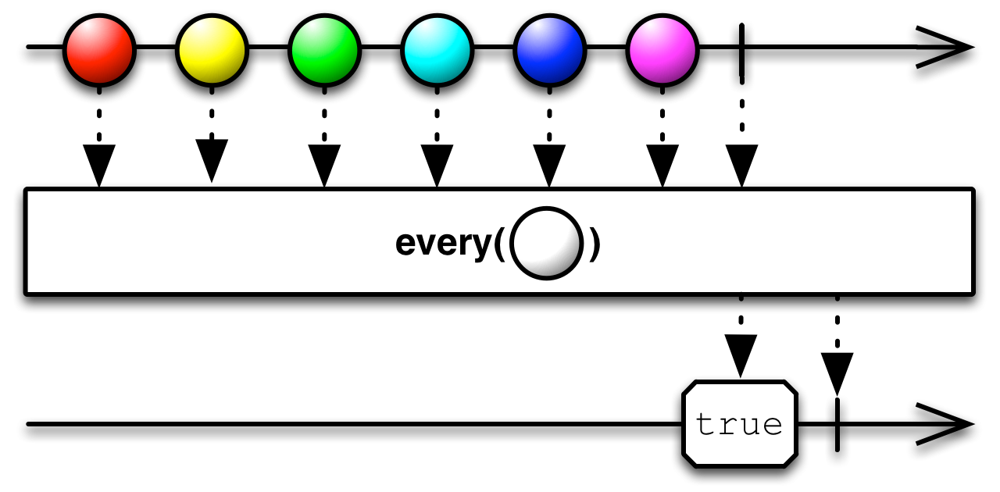
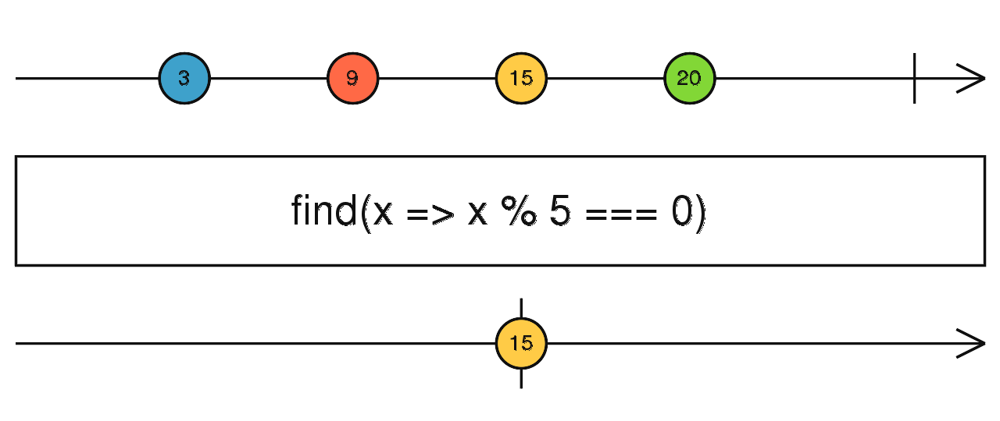
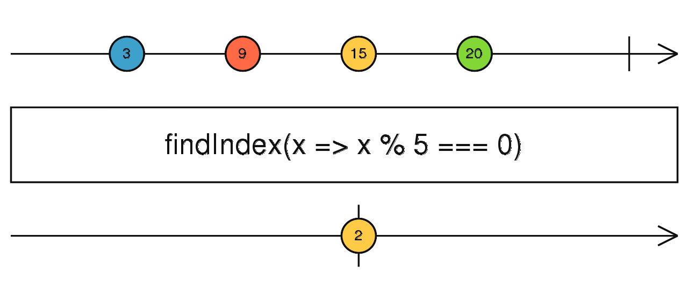
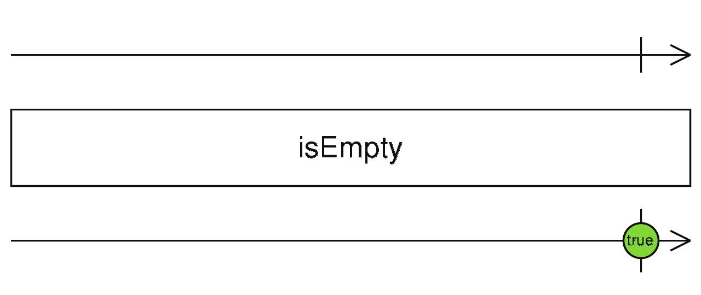

# Conditional and Boolean Operators

## defaultIfEmpty

給予預設值如果是空白時



**使用介面**

```typescript
defaultIfEmpty(defaultValue: any): Observable
```

**使用範例**

```typescript
Observable.empty()
  	      .defaultIfEmpty(42)
  		  .subscribe(value => console.log(value)); // 輸出: 42
```

## every

檢查 Observable 所送出的所有資料是否符合 every 的函式



**使用介面**

```typescript
every(predicate: function, thisArg: any): Observable
```

**使用範例**

```typescript
Observable.of(1, 2, 3, 4, 5, 6)
    .every(x => x < 5)
    .subscribe(x => console.log(x)); // 輸出：
```

## find

尋找第一筆符合條件的資料



**使用介面**

```typescript
find(predicate: function(value: T, index: number, source: Observable<T>): boolean, thisArg: any): Observable<T>
```

**使用範例**

```typescript
Observable.of(1, 2, 3, 4, 5, 6)
    .find(x => x < 5)
    .subscribe(x => console.log(x)); // 輸出: 1

Observable.of(1, 2, 3, 4, 5, 6)
    .find(x => x > 7)
    .subscribe(x => console.log(x)); // 輸出: undefined
```

## findIndex

找符合條件的資料索引位置



**使用介面**

```typescript
findIndex(predicate: function(value: T, index: number, source: Observable<T>): boolean, thisArg: any): Observable
```

**使用範例**

```typescript
Observable.of(1, 2, 3, 4, 5, 6)
    .findIndex(x => x == 2)
    .subscribe(x => console.log(x)); // 輸出 1
```


## isEmpty

判斷 Observable 是否有資料，如果沒有則回傳 `true`



**使用介面**

```typescript
isEmpty(): Observable
```

**使用範例**

```typescript
Observable.from([])
          .isEmpty()
          .subscribe(value => console.log(value)); // 輸出: true
```

