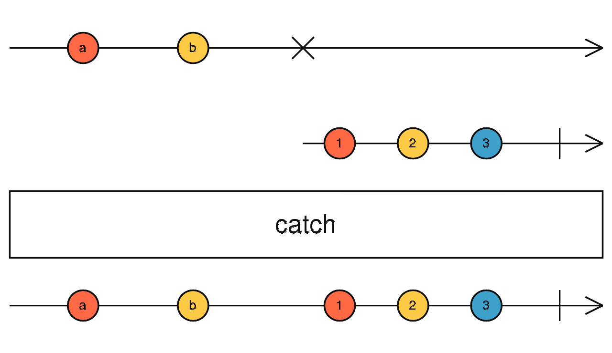
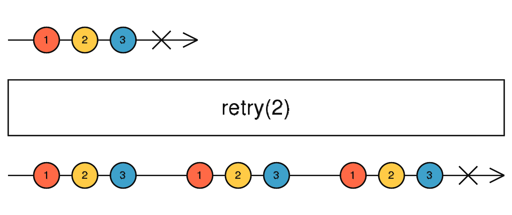
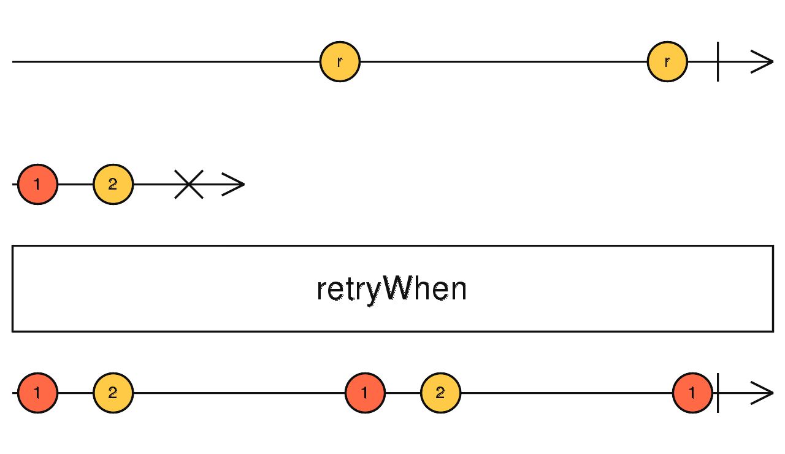

# Error Handling Operators

## catch

當Observable發生錯誤時，可由此 operator 攔截



**使用介面**

```typescript
catch(selector: function): Observable
```

**使用範例**

```typescript
Observable.of(1, 2, 3, 4, 5)
  .map(n => {
	   if (n == 4) {
	     throw 'four!';
    }
   return n;
  })
  .catch(err => Observable.of('I', 'II', 'III', 'IV', 'V'))
  .subscribe(x => console.log(x));
  // 輸出： 1, 2, 3, I, II, III, IV, V
```

## retry

當發生錯誤時，重新嘗試 n 次



**使用介面**

```typescript
retry(count: number): Observable
```

**使用範例**

```typescript
Observable.of(1, 2, 3, 4, 5)
  .map(n => {
	   if (n == 4) {
	     throw 'four!';
    }
   return n;
  })
  .retry(2)
  .subscribe(x => console.log(x));
// 輸出 : 1, 2, 3, 1, 2, 3, 1, 2, 3
```

## retryWhen

當發生錯誤時，當 notifier 發出資料時重新嘗試 



**使用介面**

```typescript
retryWhen(notifier: function(errors: Observable): Observable): Observable
```

**使用範例**

```typescript
Observable.of(1, 2, 3, 4, 5)
    .map(n => {
      if (n == 4) {
        throw 'four!';
      }
      return n;
    })
    .retryWhen(() => Observable.of('1').delay(1000))
    .subscribe(x => console.log(x));
// 輸出: 1, 2, 3, 1, 2, 3
```

