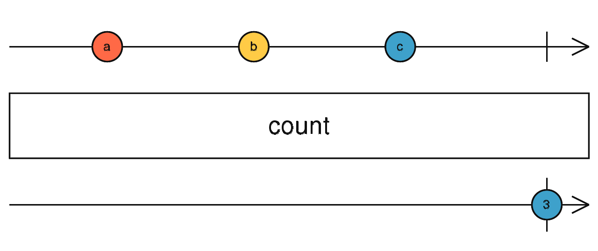
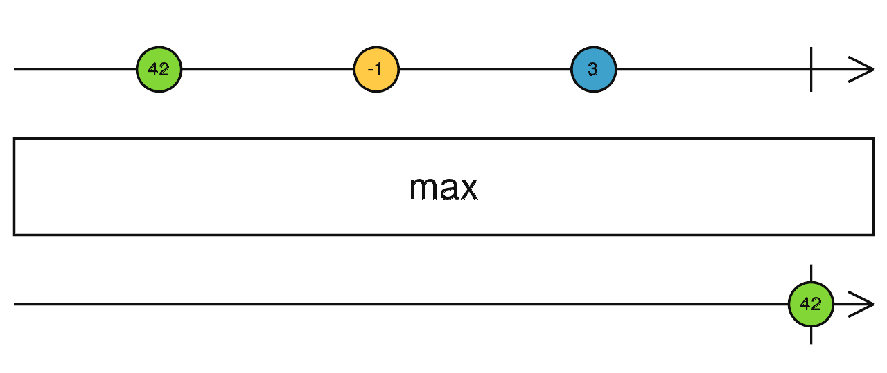
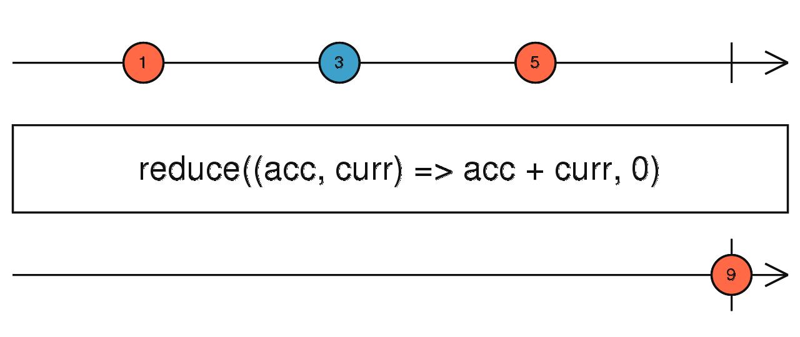

# Mathematical and Aggregate Operators

## count

計算 Observable 裡符合條件的資料筆數



**使用介面**

```typescript
count(predicate: function(value: T, i: number, source: Observable<T>): boolean): Observable
```

**使用範例**

```typescript
Observable.from([1, 2, 3, 4, 5, 6])
    .count(x => x % 3 == 0)
    .subscribe(value => console.log(value)); // 輸出: 2
```


## max

取出 Observable 資料內最大值



**使用介面**

```typescript
max(comparer: Function): Observable
```

**使用範例**

```typescript
Observable.of(5, 4, 7, 2, 8)
          .max()
          .subscribe(x => console.log(x)); // 輸出: 8

interface Person {
  age: number,
  name: string
}
Observable.of<Person>({age: 7, name: 'Foo'},
                      {age: 5, name: 'Bar'},
                      {age: 9, name: 'Beer'})
          .max<Person>((a: Person, b: Person) => a.age < b.age ? -1 : 1)
          .subscribe((x: Person) => console.log(x.name)); // 輸出: 'Beer'
}
```


## min

取出 Observable 資料內最小值


**使用介面**

```typescript
min(comparer: Function): Observable<R>
```

**使用範例**

```typescript
Observable.of(5, 4, 7, 2, 8)
          .min()
          .subscribe(x => console.log(x)); // 輸出: 2

interface Person {
  age: number,
  name: string
}
Observable.of<Person>({age: 7, name: 'Foo'},
                      {age: 5, name: 'Bar'},
                      {age: 9, name: 'Beer'})
          .min<Person>((a: Person, b: Person) => a.age < b.age ? -1 : 1)
          .subscribe((x: Person) => console.log(x.name)); // 輸出: 'Foo'
}
```

## reduce

計算 Observable 資料完成後，一次輸出。適用於會結束的 observable



**使用介面**

```typescript
reduce(accumulator: function(acc: R, value: T, index: number): R, seed: R): Observable<R>
```

**使用範例**

```typescript
Observable.from([1, 2, 3, 4, 5, 6])
    .reduce((acc, one) => acc + one, 0)
    .subscribe(value => console.log(value)); // 輸出: 21
```