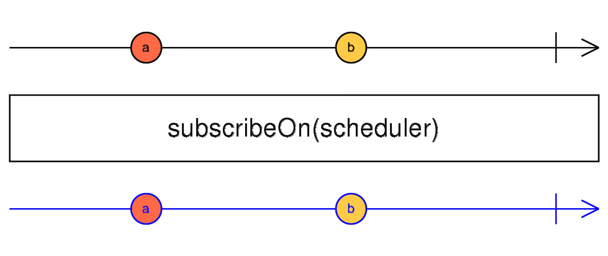

# Schedulers

Scheduler 控制一個 observable 的訂閱什麼時候開始，以及發送元素什麼時候送達，主要由以下三個元素所組成

- Scheduler 是一個資料結構。 它知道如何根據優先級或其他標準來儲存並佇列任務。
- Scheduler 是一個執行環境。 它意味著任務何時何地被執行，比如像是 立即執行、在回呼(callback)中執行、setTimeout 中執行、animation frame 中執行
- Scheduler 是一個虛擬時鐘。 它透過 `now()` 這個方法提供了時間的概念，我們可以讓任務在特定的時間點被執行。

所以 Scheduler 是用來決定 Observable 資料送出的時機點

```typescript
import 'rxjs/Rx';

import {Observable} from 'rxjs/Observable';
import {async} from 'rxjs/Scheduler/async';

const observable = Observable.create(function(observer) {
  observer.next(1);
  observer.next(2);
  observer.next(3);
  observer.complete();
});

console.log('before subscribe');
observable 
    .observeOn(async)// 設為 async
    .subscribe({
      next: (value) => {
        console.log(value);
      },
      error: (err) => {
        console.log('Error: ' + err);
      },
      complete: () => {
        console.log('complete');
      }
    });
console.log('after subscribe');

// "before subscribe"
// "after subscribe"
// 1
// 2
// 3
// "complete"
```

如果將 observeOn(async) 拿掉，結果會變成這樣

```typescript
import 'rxjs/Rx';

import {Observable} from 'rxjs/Observable';
import {async} from 'rxjs/Scheduler/async';

const observable = Observable.create(function(observer) {
  observer.next(1);
  observer.next(2);
  observer.next(3);
  observer.complete();
});

console.log('before subscribe');
observable
    .subscribe({
      next: (value) => {
        console.log(value);
      },
      error: (err) => {
        console.log('Error: ' + err);
      },
      complete: () => {
        console.log('complete');
      }
    });
console.log('after subscribe');

// "before subscribe"
// 1
// 2
// 3
// "complete"
// "after subscribe"
```

根據上述的兩段程式碼，我們知道可以透過 Scheduler 做同步/非同步的切換，除了 async, 還有什麼 Scheduler 可以使用

- queue：建立一個佇列給遞迴函式使用，避免不必要的效能問題
- asap：非同步執行，與 setTimeout 為 0 的效果一樣
- async：與 asap 很類似，但是是使用 setInterval，通常與時間性的 operator 有關
- animationFrame：與 `Window.requestAnimationFrame` 的執行週期一樣

## Scheduler 相關 operators

### observeOn

設定 Observable 的 scheduler 模式
**使用介面**

```typescript
observeOn(scheduler: *, delay: *): Observable<R> | WebSocketSubject<T> | Observable<T>
```

**使用範例**

```typescript
Observable.of(1, 2, 3)
          .observeOn(async)
          .subscribe(value => console.log(value));.
```

### subscribeOn

設定 subscribe 的 scheduler 模式

**使用介面**

```typescript
subscribeOn(scheduler: Scheduler): Observable<T>
```

**使用模式**

```typescript
Observable.of(1, 2, 3)
          .subscribeOn(async)
          .subscribe(value => console.log(value));
```

# 