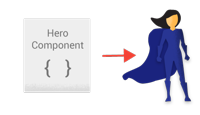

# Angular 架構

Angular 是個 Framework ，使用 HTML 與 JavaScript ( TypeScript) 來建置 Client 端應用程式。

Angular 提供一個完整的架構，我們可以依循該架構建構一個有系統，有脈絡的 SPA 應用程式，在這一章節裡，我們會說明 Angular 架構的組合元素，及元素間的關係，關係如下圖


## Modules

Angular 是由許多 `ngModules` 所組成的，我們可以透過 `ngModules` 模式來管理程式碼，進階的說明會在 `ngModules` 章節說明

任何的 Angular 應用程式一定會有一個起始模組 ( root module )，通常會稱為 `AppModule` ，而這一個起始模組裡會決定要啟動的 `Components`、`providers` 或是其他的 `Feature Modules`。

一個 `ngModule` 是一個裝飾器函式，包含一個描述區段 ( metadata)，其重要的屬性有

* declaration - 定義 `components` 、`directives` 和 `pipes` 的區塊
* exports - 開放給其他 modules 使用的項目
* imports - 注入其他 modules ，只能使用其他 modules exports 所定義的項目
* providers - 建立服務，是當下 Modules 的全域服務
* bootstrap - 要啟動的 `Component` ，僅適用於起始模組

```typescript
import { NgModule }      from '@angular/core';
import { BrowserModule } from '@angular/platform-browser';
@NgModule({
  imports:      [ BrowserModule ],
  providers:    [ Logger ],
  declarations: [ AppComponent ],
  exports:      [ AppComponent ],
  bootstrap:    [ AppComponent ]
})
export class AppModule { }
```

### Angular libraries


Angular 內建許多 modules，每一個 modules 都提供不同的功能，我們可以透過 import 的方式，使用各 modules 所提供的功能

```typescript
import { Component } from '@angular/core';
import { BrowserModule } from '@angular/platform-browser';
```

我們可以注意到，不同的 module 名稱前面都掛有 `@angular` 的名稱，這一個稱為 npm scope naming，是開發團隊用來整理 library 使用的，也讓使用者知道這些 library 都是來自同一個團隊或是來自相同的專案。

## Components



Component 是 Angular 應用程式用來顯示使用的一個重要元素，我們可以定義給 view 使用的邏輯判斷，變數顯示，或進一步的與其他 API 服務做溝通。

```typescript
export class HeroListComponent implements OnInit {
  heroes: Hero[];
  selectedHero: Hero;

  constructor(private service: HeroService) { }

  ngOnInit() {
    this.heroes = this.service.getHeroes();
  }

  selectHero(hero: Hero) { this.selectedHero = hero; }
}
```


一個完整的 component 會包含以下項目

## Templates


可在 component 的 metadata 區塊指定 template 的路徑，或是直接將 template 寫在 metadata 裡面，template 會與 component class 綁在一起，可以使用 component 所定義的屬性及方法，可以使用 directive / pipe 來加強顯示的功能，或加入其他的 component 作為顯示內容的一部份。

```html
<h2>Hero List</h2>

<p><i>Pick a hero from the list</i></p>
<ul>
  <li *ngFor="let hero of heroes" (click)="selectHero(hero)">
    {{hero.name}}
  </li>
</ul>

<hero-detail *ngIf="selectedHero" [hero]="selectedHero"></hero-detail>
```


## Metadata


Component 也有裝飾器，`@Component` ， 裡面會定義幾個重要的項目

* selector：告訴 Angular，代表目前 component 的 css selector 是什麼，例如 `<hero-list>`
* templateUrl：指定 html 檔案的路徑
* styleUrl：指定一個或多個樣式檔的檔案路徑
* providers：設定 services，須注意 service 的 scope 問題

##Data binding


Angular 提供 4 種方式來處理 template 與 component class 間的互動

* `{{ expr }}` ：將 component 的屬性顯示在 template 上
* `[property]`：將 component 的屬性綁定到 template html 元素的屬性上
* `(event)`：將 component 的方法綁定到 template html 元素的事件上
* `[( two-way-binding )]="property"`：雙向綁定的語法糖

```typescript
<li>{{hero.name}}</li>
<hero-detail [hero]="selectedHero"></hero-detail>
<li (click)="selectHero(hero)"></li>
```

整體的運作方式如下圖


## Directives

Components 是有 template 的 directives，Directives 的裝飾器是 `@Directive`。Directives 分成兩類

1. 結構性的 directives：針對顯示結構上的異動

   ```typescript
   <li *ngFor="let hero of heroes"></li>
   <hero-detail *ngIf="selectedHero"></hero-detail>
   ```

2. 屬性類別的 directives：擴充目前所屬的元素的功能

   ```typescript
   <input [(ngModel)]="hero.name">
   ```


## Services

Service 通常是一個有特定目的的 class 。當然也可以是單純地值，或是函式，幾乎所有東西都可以成為 service。

## Dependency injection

Angular 另外一個很重要的機制，就是 Dependency injection，Angular 提供一個很完整的 DI 機制，在開發過程中，如果需要使用到 service 時，都必須透過注入的方式取得。


